# |Ascis 2024|

 ```Reverse Engineering:```

 Challenge : *RE*

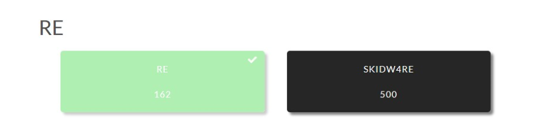

So this is a Challenge in Ascis 2024 CTF

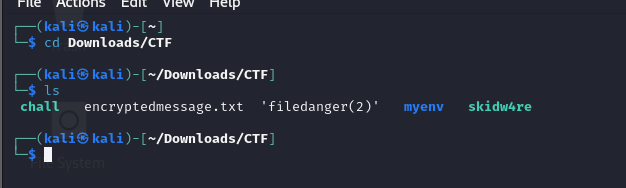

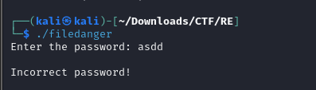

I use ```file <file name>``` to check this ```filedanger```
and I know that it's a ELF 64-bit  

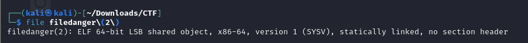

After using ```cat <filename>```, I can say it an UPX packer by look in the last line ```PX!UPX! fwww�7{��?t▒�?n� ```
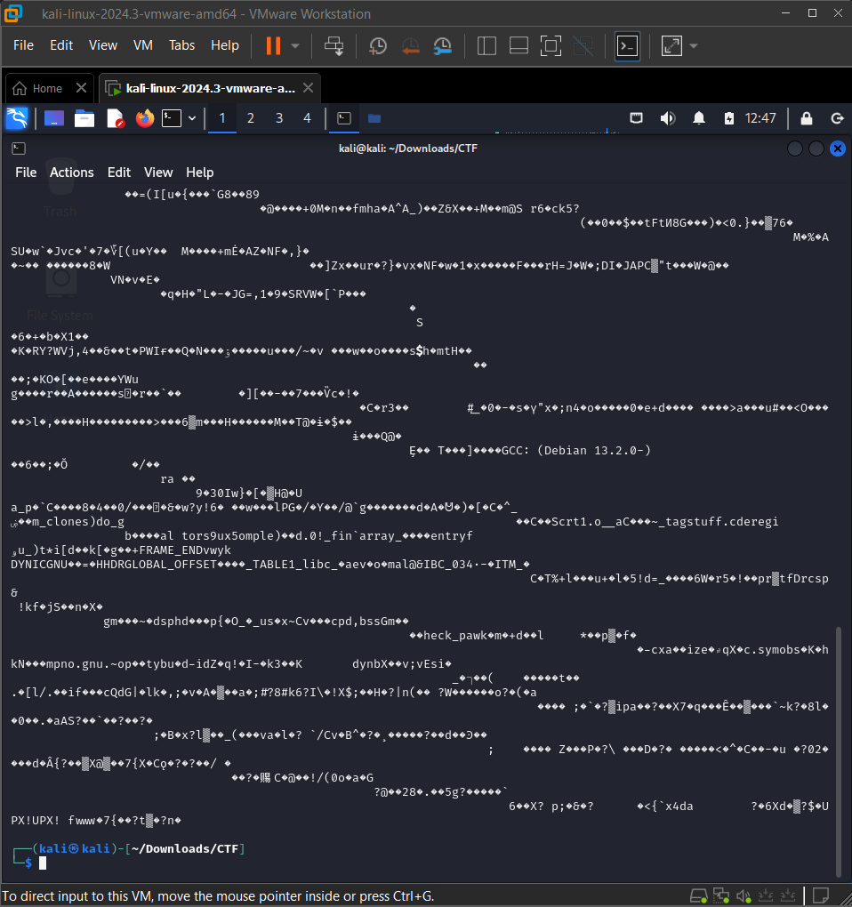

All I need is unpack it and check it again with ```cat``` again . 
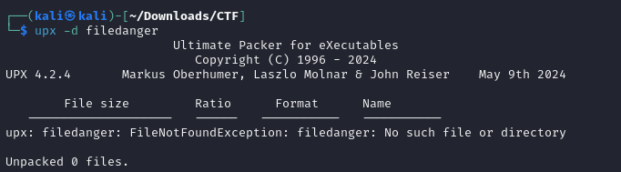

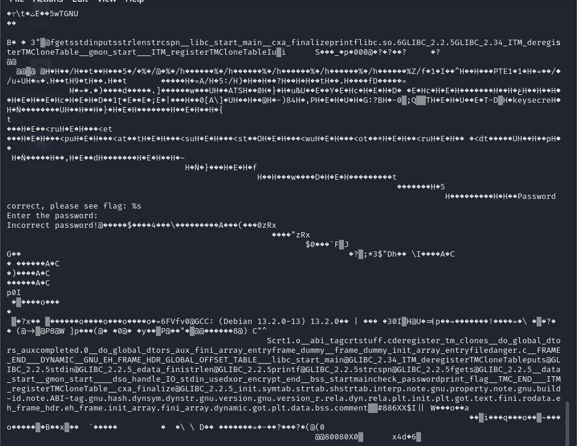

It's seem better now. I'll disassemble it by using IDA 

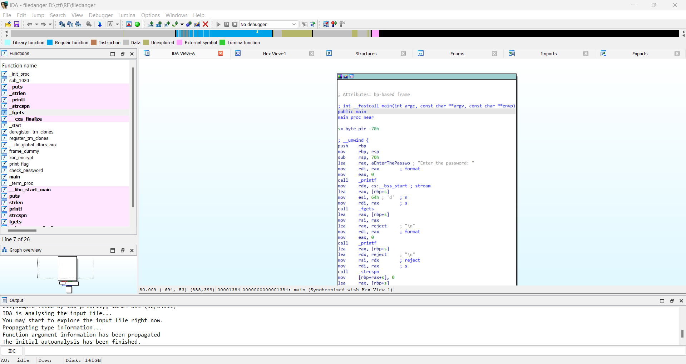

I can read the code after unpack. By read this code we only need to check the ```check_password``` function.
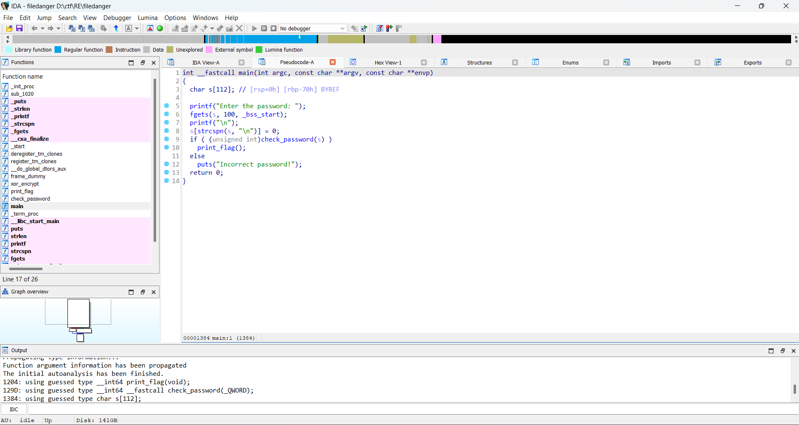
The check_password function is performing a series of byte comparisons to validate the password. Here's a breakdown of what the function is doing:
- Length Check: The password must be exactly 10 characters long (strlen(a1) != 10).

- Character Checks: The function then compares each byte (character) of the input password against hardcoded values:

```
a1[0] == 114 and a1[1] == 101 (which corresponds to "r" and "e")
a1[2] == 112 and a1[3] == 97 (which corresponds to "p" and "a")
a1[4] == 115 and a1[5] == 115 (which corresponds to "s" and "s")
a1[6] == 119 and a1[7] == 111 (which corresponds to "w" and "o")
a1[8] == 114 and a1[9] == 100 (which corresponds to "r" and "d")
```
And the password is ```repassword```

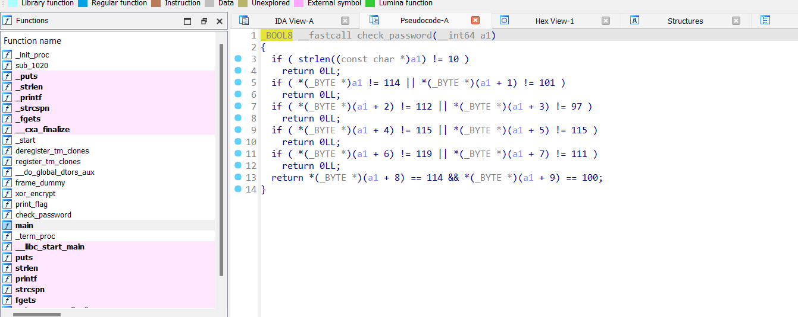

Just need to type the right password and here's the flag: 

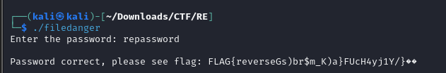