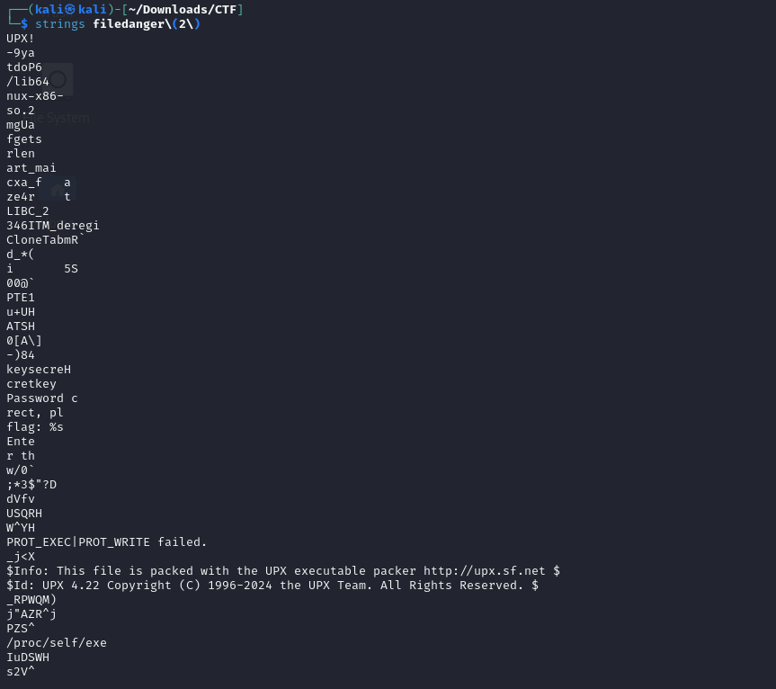

# |Ascis 2024|

 ```Reverse Engineering:```

 Challenge : *RE*


So this is a Challenge in Ascis 2024 CTF


I use ```file <file name>``` to check this ```filedanger```
and I know that it's a ELF 64-bit  


After using ```cat <filename>```, I can say it an UPX packer by look in the last line ```PX!UPX! fwww�7{��?t▒�?n� ```


All I need is unpack it and check it again with ```strings``` . 


I was right !
